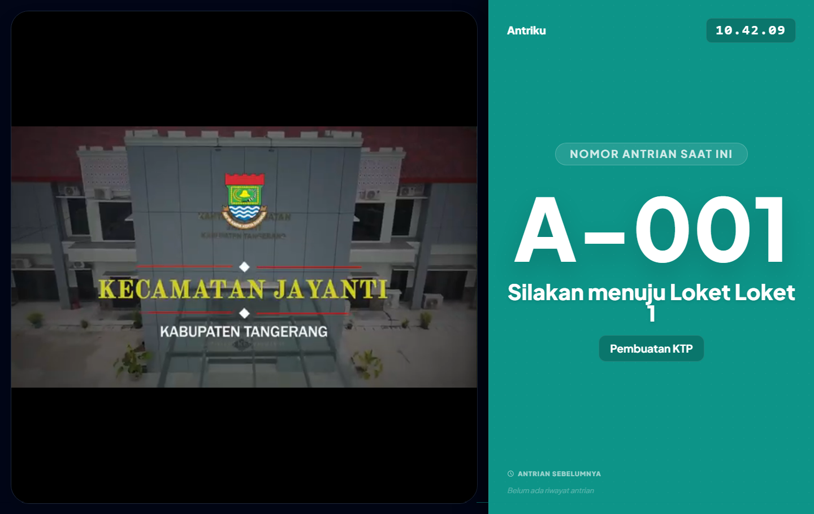
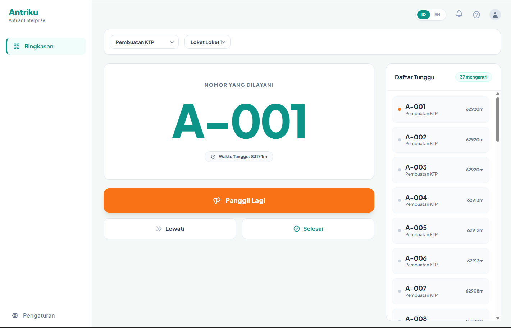
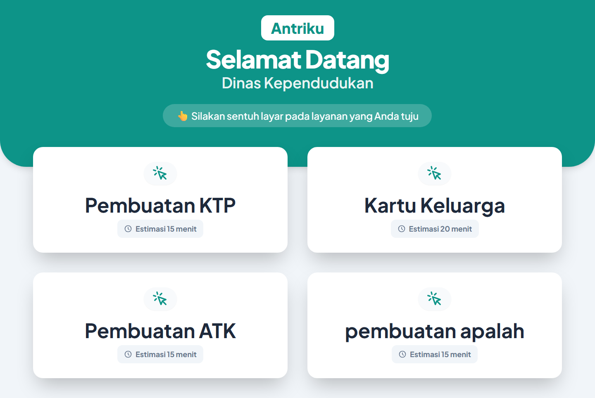

# 🎫 Antriku - Real-Time Queue Management System

<p align="center">
  
</p>

<p align="center">
  <strong>Sistem Manajemen Antrean Real-Time berbasis Web (Multi-Tenant)</strong>
</p>

<p align="center">
  
  
  
  
</p>

---

## 🌟 Tentang Antriku

**Antriku** adalah aplikasi manajemen antrean berbasis web (Multi-Tenant) yang dirancang untuk instansi/layanan publik guna mempermudah proses antrean secara teratur, modern, dan real-time. 

Aplikasi ini menggunakan teknologi **WebSockets (Laravel Reverb)** untuk sinkronisasi instan antara tindakan petugas di loket dengan layar TV Display serta halaman pemantauan warga secara langsung tanpa perlu memuat ulang halaman (*zero latency*).

---

## 📸 Tampilan Aplikasi (Screenshots)

Berikut adalah tampilan antarmuka dari aplikasi **Antriku**:

### 1. TV Display Dashboard
*Layar monitor utama yang dipasang di ruang tunggu. Dilengkapi pemutar video promosi instansi dari YouTube, jam digital real-time, suara panggilan otomatis (Text-to-Speech), dan daftar riwayat antrean.*

<p align="center">
  <!-- Taruh screenshot TV Display Anda di folder public/screenshots/tv-display.png dan update link ini -->
  
</p>

### 2. Panel Petugas / Loket (Operator Dashboard)
*Halaman bagi petugas loket untuk memanggil antrean berikutnya, memanggil ulang (recall) jika warga tidak mendengar, melewati antrean (skip), menyelesaikan pelayanan, serta membuka/tutup status loket.*

<p align="center">
  <!-- Taruh screenshot Panel Petugas di folder public/screenshots/dashboard-petugas.png dan update link ini -->
  
</p>

### 3. Kiosk Ambil Antrean & Tracking Mandiri
*Halaman bagi warga untuk mengambil nomor antrean secara mandiri berdasarkan jenis layanan dan melacak nomor antrean yang sedang berjalan langsung dari smartphone mereka.*

<p align="center">
  <!-- Taruh screenshot Kiosk/Tracking di folder public/screenshots/kiosk-tracking.png dan update link ini -->
  
</p>

---

## 🚀 Fitur Utama

1. **Multi-Tenant / SaaS-Ready:** Setiap instansi memiliki data antrean, konfigurasi loket, dan branding (logo serta video promosi) masing-masing.
2. **Real-Time Synchronisation:** Menggunakan **Laravel Reverb** untuk menjamin perubahan data langsung tampil ke layar TV Display saat petugas menekan tombol panggil.
3. **Automated Voice Announcement (TTS):** Menggunakan *SpeechSynthesis API* bahasa Indonesia untuk memanggil nomor antrean secara dinamis (Contoh: *"Nomor antrian A-5, silakan menuju loket 1"*).
4. **Interactive TV Display:** Integrasi pemutar video YouTube instansi dan jam digital.
5. **Dashboard Kontrol Petugas Lengkap:** Fitur *Call next, Recall, Skip, Complete,* dan *Toggle status* buka/tutup loket.

---

## 🛠️ Tech Stack

*   **Backend:** PHP 8.3+, Laravel 13, Laravel Reverb (WebSockets), Inertia.js (React Adapter)
*   **Frontend:** React 18, Tailwind CSS v4, Alpine.js v3, Headless UI
*   **Database:** MySQL
*   **Asset Bundler:** Vite

---

## ⚙️ Cara Instalasi & Menjalankan Lokal

### 1. Clone Repository & Install Dependencies
```bash
git clone https://github.com/username-anda/antriku.git
cd antriku

# Install dependensi PHP & JavaScript
composer install
npm install
```

### 2. Konfigurasi Lingkungan (.env)
Salin berkas `.env.example` ke `.env`:
```bash
cp .env.example .env
```
Sesuaikan konfigurasi database (`DB_DATABASE`, `DB_USERNAME`, `DB_PASSWORD`) dan generate application key:
```bash
php artisan key:generate
```

### 3. Jalankan Migrasi Database & Seeder
```bash
php artisan migrate --seed
```

### 4. Menjalankan Server Aplikasi
Untuk menjalankan proyek ini di mode lokal/development, Anda harus menjalankan proses-proses berikut:

#### **Cara Cepat (Rekomendasi):**
Gunakan perintah pintas *composer* yang telah kami konfigurasi untuk menjalankan backend, frontend, queue, dan log secara bersamaan:
```bash
composer run dev
```

#### **Buka Terminal Baru & Jalankan WebSocket Server (Reverb):**
```bash
php artisan reverb:start
```

Aplikasi sekarang dapat diakses melalui browser Anda di **`http://127.0.0.1:8000`**.

---

## 📄 Lisensi
Proyek ini dilisensikan di bawah [MIT License](LICENSE).
